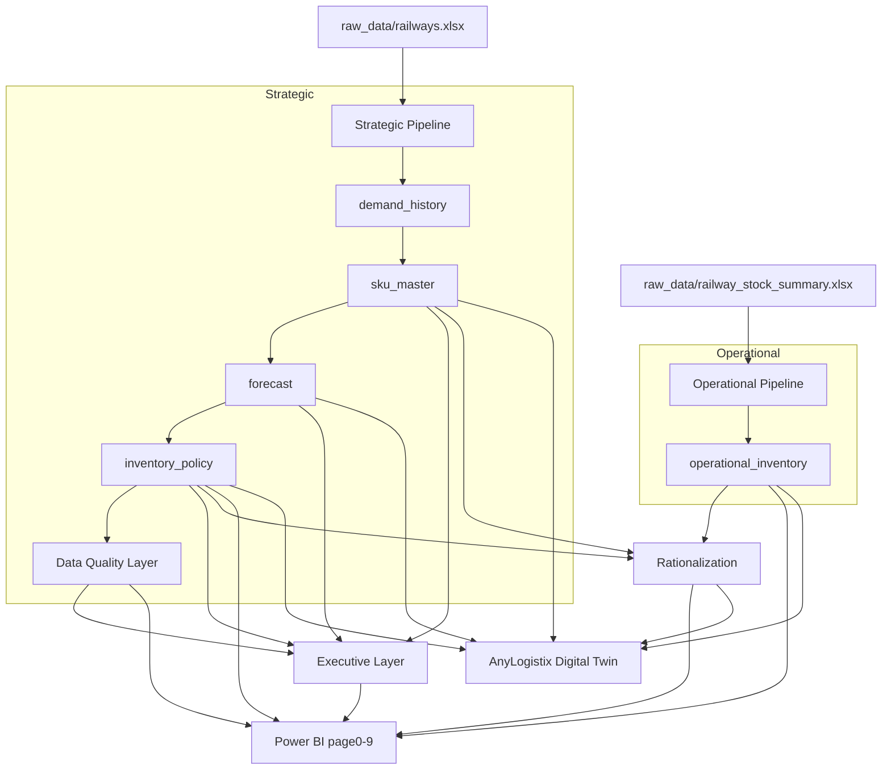

# Railway Signalling Spare Parts — Analytics & Inventory Optimization Platform

A parallel, fully **additive** workflow built alongside the existing Walmart (M5) pipeline in
this repository. It turns Southern Railway S&T stores data into decision-support outputs for
forecasting, inventory optimization, rationalization, executive reporting, Power BI and AnyLogistix.

> **The Walmart workflow (notebooks 01–06) and all its outputs are untouched.** Every railway
> artifact lives under `railway/` and `notebooks/07_railway_inventory_analysis.ipynb`.

---

## 1. Project Overview
Two **independent business domains**, never merged (only ~7 PL codes overlap):

| Domain | Source | Items | Answers |
|---|---|---|---|
| **Strategic** | `raw_data/railways.xlsx` | 59 vital S&T items | *What should Southern Railway buy?* |
| **Operational** | `raw_data/railway_stock_summary.xlsx` | 907 depot items | *What is happening inside the stores?* |

## 2. Business Problem
Southern Railway S&T stores must decide, with limited budget, **which signalling spares to
procure, retain, review, rationalize or dispose** — while protecting safety-critical (S1/S2)
availability. Current state: **50/59** strategic items below reorder point, **190** operational
dead-stock items (₹7.63 cr), **0** excess — a *service-risk*, not an inventory-reduction, problem.

## 3. Architecture Diagram

Lineage is recorded for all 44 outputs in `railway/outputs/data_lineage_report.csv`
(Strategic / Operational / Derived).

## 4. Strategic Pipeline
`railway_data_preparation` → `railway_classification` → `railway_forecasting` →
`railway_inventory_optimization` → `railway_data_quality` → `railway_executive_summary`.
Produces `railway_demand_history.csv`, `railway_sku_master.csv`, `railway_forecast.csv`,
`railway_inventory_policy.csv` and the executive KPI set.

## 5. Operational Pipeline
`railway_operational_analysis` reads **only** `railway_stock_summary.xlsx` (via a raw-OOXML XML
loader, because the workbook's stylesheet is corrupt for openpyxl/pandas) and produces aging,
dead-stock, slow-moving, valuation and Pareto-ABC views → `railway_operational_inventory.csv`.

## 6. Forecasting Methodology
- **Primary (official):** `Forecast_2026_27 = 0.40·AAC + 0.30·EAR + 0.20·MA + 0.10·CAGR` — stable, explainable.
- **Secondary (benchmark, never overrides):** Croston, SBA, TSB (reused verbatim from notebook 04), Holt.
- **Backtest:** train 2020-21/2022-23/2023-24/2024-25 → predict 2025-26; MAE/MAPE/Bias.
- **Recommendation by demand class:** Smooth→Blend, Intermittent→Croston, Erratic→SBA, Lumpy→TSB, Dead→Zero.
- Prophet/ARIMA/LightGBM/XGBoost are **excluded** (only 5 annual observations).

## 7. Inventory Optimization Methodology
- **Lead time:** Tier-1 `EAR/Pending` bounded [1,12] months; Tier-2 fallback by criticality (S1=6,S2=4,S3=3,S4=2).
- **Service level by ABC×Criticality** → z via `scipy.stats.norm.ppf`.
- **Safety stock** `Z·σ·√LT`, **ROP** `forecast·LT/12 + SS`, min/max, **criticality-weighted priority** (S1=10…S4=1).
- **Budget allocation:** PuLP knapsack maximises criticality-weighted coverage under budget (₹50L/1cr/2cr/5cr).

## 8. Rationalization Framework
Unified asset register (outer-merge by PL_Code, a *derived view* — sources never merged) →
**Procure Immediately / Retain / Monitor / Rationalize / Dispose**, with documented fallbacks
for items lacking a dimension.

## 9. Power BI Layer
Visualization-only — **all logic pre-computed**. `railway/outputs/powerbi/`:
`page0_executive_dashboard` … `page9_management_actions` plus `op_*` operational aggregates and
`page6_data_quality`.

## 10. AnyLogistix Layer
Digital-twin foundation in `railway/outputs/anylogistix/`: `locations`, `products`, `demand`,
`inventory_policy`, `facilities`, `service_risk`, `multi_echelon_candidates`,
`procurement_scenarios`, `digital_twin_readiness`. Coordinates are **NULL/Placeholder** (never
fabricated); demand uses **Equal_Split** (no division % in generated outputs).

## 11. Data Quality Controls
- `railway_data_quality.py` — detects per-km/per-drum unit mismatches (`Unit∈{MTR,…}` & `Unit_Cost>₹1L`),
  produces **parallel `Normalized_*` fields** (originals never overwritten) + audit trail.
- `schema_validation.py` — fail-fast on missing columns, bad types, dup PL, negatives, invalid vocab.
- `railway_lineage.py` — full source→output lineage.
- `railway_regression.py` — baseline of key distributions; flags drift.

## 12. Test Framework
`railway/tests/` — **53 pytest tests, all passing** across all 8 modules (pure logic + output schemas),
including a regression test for the operational NaN-aging bug.

## 13. Performance Results
Core per-SKU transforms scale **linearly (O(n), 1.02× drift 10k vs 1k)**: 1k≈0.7s, 5k≈3.7s, 10k≈7.3s,
peak memory ≤4 MB. Hotspot = per-row `iterrows` + statsmodels Holt (vectorise before ~100k items).

## 14. Production Readiness Assessment
Overall **78/100** (Code 82 · Tests 76 · Data Quality 80 · Scalability 76 · Maintainability 85 ·
Deployment 70). See `RAILWAY_PRODUCTION_READINESS_REPORT.md`. Verdict: **YES — WITH CONTROLS** for
depot decision-support.

## 15. Known Limitations
1. 5 annual observations (2021-22 missing) → forecasts are directional.
2. Locked Safety_Stock formula mixes annual σ with √months → conservative magnitudes; use as ranking.
3. 2 cable SKUs carry per-km rates (normalized; originals preserved).
4. No geo-coordinates / division-level demand in generated outputs.
5. Strategic 59 and operational 907 overlap on ~7 PL codes only.

## 16. Future Enhancements
Monthly issue-transaction ingestion · real coordinates + division demand · wire `Asset_Type`
(Kavach/IPS/relay/point-machine) · vectorise loops · depot→division hierarchy · star-schema
warehouse for multi-zone scale.

---

## Quick Start

### Installation
```bash
# Python 3.11; from repo root
pip install -r requirements.txt      # pandas, numpy, scipy, openpyxl, pulp, statsmodels
pip install pytest                   # dev-only, for the test suite
```

### Run order (each module is idempotent; run from repo root)
```bash
python -c "from railway import railway_data_preparation as m; m.run()"      # 1 demand history
python -c "from railway import railway_classification as m; m.run()"        # 2 sku master
python -c "from railway import railway_forecasting as m; m.run()"           # 3 forecast
python -c "from railway import railway_inventory_optimization as m; m.run()"# 4 policy
python -c "from railway import railway_data_quality as m; m.run()"          # 5 DQ normalization
python -c "from railway import railway_executive_summary as m; m.run()"     # 6 executive KPIs
python -c "from railway import railway_operational_analysis as m; m.run()"  # 7 operational
python -c "from railway import railway_inventory_rationalization as m; m.run()" # 8 rationalization
python -c "from railway import railway_powerbi_export as m; m.run()"        # 9 Power BI
python -c "from railway import railway_anylogistix_export as m; m.run()"    # 10 AnyLogistix
python -c "from railway import railway_lineage as m; m.run()"               # lineage report
```
Or run the orchestration notebook: `notebooks/07_railway_inventory_analysis.ipynb`.

### Expected outputs (`railway/outputs/`)
`railway_demand_history.csv` · `railway_sku_master.csv` · `railway_forecast.csv` ·
`railway_inventory_policy.csv` · `railway_data_quality.csv` · `executive_kpi_summary.{csv,json}` ·
`railway_operational_inventory.csv` · `railway_inventory_rationalization.csv` ·
`powerbi/page0..page9 + op_*` · `anylogistix/*.csv` · `data_lineage_report.csv`.

### Validation commands
```bash
python -c "from railway import schema_validation as s; print(s.validate_all(raise_on_error=False) or 'PASS')"
python -c "from railway import railway_regression as r; print(r.compare_to_baseline() or 'no drift')"
python -c "from railway import performance_test as p; p.run()"
```

### pytest
```bash
python -m pytest railway/tests -q          # 53 tests
```

---

## Depot User Guide — *How a Depot Officer Should Use This Platform*

| Cadence | Report | Use |
|---|---|---|
| **Weekly** | `powerbi/page1_procurement.csv`, `executive_top10_procurement.csv` | Watch S1/S2 items at/below ROP; raise urgent indents |
| **Weekly** | `powerbi/page0_executive_dashboard.csv` | Turn-risk %, procurement-required value at a glance |
| **Monthly** | `op_inventory_aging.csv`, `operational_top50_slow_moving.csv` | Track aging drift; spot newly slow-moving stock |
| **Monthly** | `operational_top50_dead_stock.csv` | Build the disposal review list (190 candidates) |
| **Procurement** | `railway_inventory_policy.csv` (ROP, min/max, priority) | Decide order quantities (as *ranking* — see controls) |
| **Disposal** | `railway_inventory_rationalization.csv` (Action=Dispose) | Identify >2-year idle stock for write-off review |
| **Budget** | `powerbi/page8_budget_scenarios.csv` | See what ₹50L/1cr/2cr/5cr can cover |

## Management User Guide — *How DRM / PCSTE / CSTE Should Use This Platform*

| Need | Report | Read |
|---|---|---|
| **Procurement planning** | `page1_procurement`, `page8_budget_scenarios` | 23 immediate-priority vital items; budget-coverage trade-offs |
| **Inventory reduction** | `page5_rationalization`, `op_dead_stock` | 190 dispose + 327 rationalize items, ₹ value freed |
| **Safety-risk monitoring** | `anylogistix/service_risk.csv`, page3_criticality | S1/S2 exposure, priority-ranked stockout risk |
| **Budget allocation** | `page8_budget_scenarios`, `procurement_scenarios` | Criticality coverage per ₹ scenario (PuLP-optimised) |
| **Multi-echelon planning** | `anylogistix/multi_echelon_candidates.csv` | 12 A/B1 × S1/S2 candidates for stocking-location studies |

---

## Final Question — *What decisions can management safely make using this platform today?*

### ✅ Safe Decisions (act now)
- **Prioritise** which vital S1/S2 spares to procure first (priority ranking, top-10 lists).
- **Identify** dead stock (190 items) and slow movers (327) for **review**.
- **Compare** budget scenarios to choose a sanction level by criticality coverage.
- **Monitor** stores health KPIs monthly (Dead Stock %, Slow Moving %, Turn Risk %).
- **Target** the 12 multi-echelon candidates for further study.

### 🔶 Decisions Requiring Human Review
- **Exact order quantities** — Safety_Stock/ROP magnitudes are conservative (locked formula); confirm with a period-consistent recalculation before indenting.
- **Disposal write-offs** — the 190 dead-stock items are a *review list*; depot officer sign-off required.
- **High-value cable items** — confirm the 2 unit-normalizations (`railway_data_quality.csv`) before any value/disposal decision.

### ⛔ Decisions Not Yet Supported
- **Geographic network optimization** — needs real division/depot coordinates (currently Placeholder).
- **Division-level demand allocation** — currently Equal_Split (needs division consumption %).
- **Long-horizon / seasonal forecasting** — only 5 annual points exist; not contractual.
- **Zonal / multi-zone rollout** — single-zone (Southern) today.
